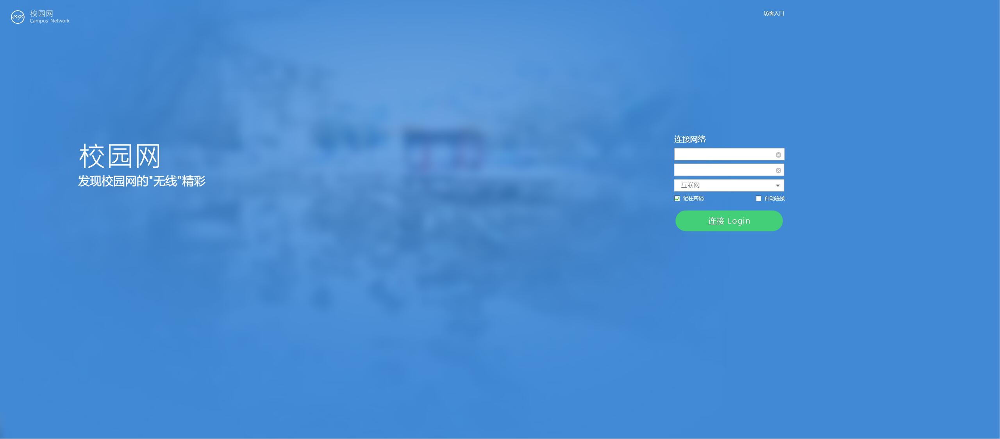

# 齐鲁工大校园网常见问题一览

## 如何连接校园网？
校园网覆盖所有校区，提供 **有线/无线** 两种接入模式，同学们可自行选择合适的方式进行接入。

- 有线接入     
该接入方式网络带宽较大、延时较为稳定，应当是您首选的接入方式。   
如选择该种接入方式，您可自行寻找楼宇内墙角或AP尾部的下行接口，并使用网线连接上网设备。
- 无线接入   
该接入方式网络带宽较小、延时会有抖动、但连接较为方便。
如选择该种接入方式，请使用带有WiFI功能的上网设备，查找名称为**QLU-2.4G**或**QLU-5.8G**的WiFi信号并连接。
- 上网认证   
无论您选择哪种方式接入校园网，都需要进行上网认证才可正常访问网络。   
当您连接到校园网后，上网设备会弹出如下图所示的认证页面。   
在页面中输入您的上网账号（学号）、上网密码（身份证后6位）并选择**互联网**即可认证。

---

## 如何修改校园网密码？

校园网密码默认为身份证号后6位，如您需要修改密码，请访问 [校园网自助服务系统](http://172.17.21.111:8080) 进行修改。

---

## 如何开通校园网？

齐鲁工业大学校园网现阶段由中国移动代运营，如您需要开通校园网，请根据下述角色进行操作。

- 在校本科生   
请与校园移动营业厅沟通以获取最新的校园网开通资费。

- 在校研究生   
我校为在校研究生提供免费的校园网使用权限，账号为学号，初始密码为身份证号后6位。

- 在职教职工   
我校为在职教职工提供免费的校园网使用权限，账号为工号，初始密码为身份证号后6位。   
如您是新入职的教职工，请携带证明文件前往长清校区图书馆网络信息中心C101办公室办理校园网开通手续。   

有任何疑问，可致电网络信息中心 0531-89631358。
